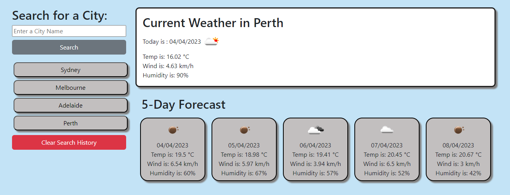

# Weather-Dashboard

```
The link for my deployed wesite can viewed here
https://shiby-mathew.github.io/Weather-Dashboard/

```

## Description

```md
This application allows user to search for a city to get the current weather and 5-day forecast. It will display the the city name, the date, an icon representation of weather conditions, the temperature, the humidity, the wind speed. Cities that user previously looked up will be saved in their local storage.Recently viewed city name shown in the dashboard, and a button to clear local storage datas.
```

## User Story

```
AS A traveler
I WANT to see the weather outlook for multiple cities
SO THAT I can plan a trip accordingly
```

## Acceptance Criteria

```
GIVEN a weather dashboard with form inputs
WHEN I search for a city
THEN I am presented with current and future conditions for that city and that city is added to the search history
WHEN I view current weather conditions for that city
THEN I am presented with the city name, the date, an icon representation of weather conditions, the temperature, the humidity, and the wind speed
WHEN I view future weather conditions for that city
THEN I am presented with a 5-day forecast that displays the date, an icon representation of weather conditions, the temperature, the wind speed, and the humidity
WHEN I click on a city in the search history
THEN I am again presented with current and future conditions for that city
```

### Usage

```

* This app is a weather dashboard allows user to search for a city to see current weather and 5-day forcast.
* It will dispaly city name, the date, an icon an icon representation of weather conditions, the temperature, the humidity, and the wind speed
* It will display 5-day forecast with date, an icon representation of weather conditions, the temperature, the wind speed, and the humidity
* Searched city is added to the search history and when you click on a city in the search history,it will display current and future conditions for that city

```

## Mock-Up

The following are some images of this functionality:





### Technologies Used

```
OpenWeather API
Bootstrap
JavaScript
```
